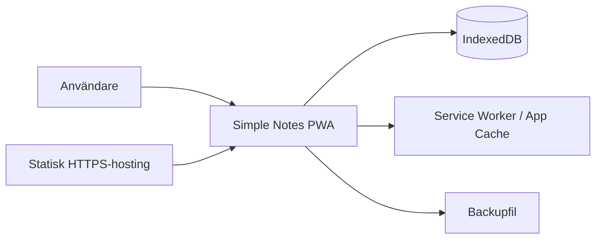

# Simple Notes – Målarkitektur

## 1. Arkitekturmål

Simple Notes ska ha en så liten och robust arkitektur som möjligt för att stödja första versionens viktigaste egenskap: **öppna appen och börja skriva direkt**.

Arkitekturen prioriterar därför:

- **offline-first** – kärnfunktioner ska fungera utan nätverk efter att appen laddats/installerats,
- **lokalt dataägarskap** – användarens anteckningar lagras på den egna enheten och skickas inte till en backend,
- **låg driftkomplexitet** – ingen server, databas eller inloggning krävs i version 1,
- **datatålighet** – versionshanterad persistence, migrationer och fullständig backup/restore,
- **snabb antecknings-UX** – domän- och UI-struktur får inte tvinga användaren genom dokument-, mapp- eller metadataflöden innan text kan skrivas,
- **framtida utbyggbarhet** – framför allt stöd för bilder/bilagor utan att grundmodellen behöver göras om,
- **portabilitet** – Safari/iOS/iPadOS och moderna Chromium-baserade desktopbrowser ska stödjas.

Projektet klassificeras som **medium** eftersom datatålighet, offlinebeteende och säker backup/restore kräver särskild verifiering, trots ett litet gränssnitt.

## 2. Systemkontext

Simple Notes är en klientbaserad PWA med en enda användare och inga server-side integrationer i version 1.



### 2.1 Trust boundaries

- Anteckningsdata stannar normalt inom webbläsarens origin-lagring på användarens enhet.
- Backupfil lämnar appens lagring först när användaren uttryckligen exporterar den.
- Importerad backup betraktas som opålitlig input tills den har validerats.
- Den statiska hostingen levererar applikationskod men äger inte eller lagrar användarens anteckningsdata.

## 3. Huvudkomponenter

### 3.1 Web UI

Ansvarar för:

- anteckningsflöde och direkt skrivläge,
- sektioner och möten,
- åtgärds- och viktigtvyer,
- sökning,
- backup/restore-dialoger,
- responsiv layout och PWA-installationsupplevelse.

UI ska vara tunt i förhållande till domän- och persistence-logik. Det ska inte själv implementera IndexedDB-transaktioner eller backupformat.

### 3.2 Application/Domain layer

Ansvarar för applikationens regler och användningsfall, exempelvis:

- skapa/redigera anteckning,
- starta/avsluta sektion,
- koppla ny anteckning till aktiv sektion,
- markera/slutföra åtgärd,
- markera som viktigt,
- söka och filtrera,
- orkestrera backup/restore.

Detta lager ska vara frikopplat från React-komponenter och från konkreta IndexedDB-anrop så att regler kan testas utan browser-UI.

### 3.3 Persistence layer

Ansvarar för:

- lokal persistence i IndexedDB,
- databasversion och migrationer,
- atomiska operationer där flera objekt behöver ändras tillsammans,
- indexerad hämtning av kronologiskt flöde och specialvyer,
- lagringsmetadata där browsern stödjer det.

`localStorage` får användas för små icke-kritiska preferenser om behov uppstår, men **inte** för primär anteckningsdata.

### 3.4 Backup/Restore service

Ansvarar för:

- export av hela återställningsbara datamängden,
- versionsmärkt backupformat,
- schema- och innehållsvalidering före restore,
- migration av äldre stödda backupversioner,
- säker restore där befintlig data inte påverkas innan filen har validerats,
- verifiering efter import.

Backup/restore ska vara separerat från UI och IndexedDB-detaljer så att round-trip kan testas automatiserat.

### 3.5 PWA/Offline layer

Ansvarar för:

- web app manifest,
- service worker,
- cache av appskal och statiska resurser,
- kontrollerad uppdatering av applikationskod,
- att cachehantering aldrig används som lagringsmekanism för användardata.

Service worker äger **inte** anteckningsdata.

## 4. Ansvar och gränser

Arkitekturen följer en enkel riktning:

```text
React UI
  → Application/Domain
    → Persistence / Backup adapters
      → Browser APIs
```

Viktiga gränsregler:

- React-komponenter får anropa application services/hooks men ska inte sprida direkta IndexedDB-anrop genom UI:t.
- Domänregler ska inte bero på service worker eller hostingmiljö.
- Persistence-lagret ska inte innehålla presentationslogik.
- Backupformatet ska byggas från en explicit exportmodell och inte från en rå dump av browserdatabasen.
- Importerad text ska behandlas som data, inte HTML.

Det behövs ingen tung hexagonal/CQRS/event-driven arkitektur. Separationen ovan finns endast där den reducerar faktisk risk och förbättrar testbarhet.

## 5. Viktiga dataflöden

### 5.1 Skapa anteckning

```text
Användare
→ skrivfält
→ application service
→ kontroll av aktiv sektion
→ nytt NoteBlock med stabilt ID + createdAt
→ IndexedDB transaction
→ UI uppdateras
```

Appen ska optimistiskt kunna ge en snabb upplevelse, men en anteckning får inte presenteras som säkert sparad om persistence faktiskt misslyckats.

### 5.2 Starta och avsluta sektion

Start:

```text
UI
→ createSection(...)
→ Section sparas
→ aktiv sektion sätts lokalt/persistant
→ efterföljande NoteBlock får sectionId
```

Avslut:

```text
UI
→ closeSection(sectionId)
→ endedAt registreras
→ aktiv sektion rensas
→ nästa NoteBlock blir fristående
```

Endast en sektion är aktiv åt gången i version 1.

### 5.3 Slutföra åtgärd

```text
UI
→ completeAction(noteId, resolution)
→ domänvalidering
→ action-status + resolution + completedAt uppdateras
→ samma NoteBlock visas uppdaterat i både flöde och Åtgärder
```

Åtgärden är alltså inte ett duplicerat anteckningsobjekt; specialvyn projicerar samma underliggande data.

### 5.4 Backup

```text
UI
→ Backup service
→ läs komplett återställningsbar snapshot
→ skapa versionerad exportmodell
→ serialisera
→ browser download
```

Export ska fungera offline.

### 5.5 Restore

```text
Filval
→ läs fil
→ parse
→ formatvalidering
→ versionskontroll/migration i minne
→ innehållsvalidering
→ sammanfattning + användarbekräftelse
→ ersätt lokal datamängd i kontrollerad transaktion
→ verifiera läsbarhet
→ ladda om relevant application state
```

Om validering misslyckas ska befintlig data vara oförändrad.

## 6. Datamodell och dataägarskap

Användaren äger all anteckningsdata. IndexedDB är lokal system-of-record.

### 6.1 Centrala objekt

#### NoteBlock

Representerar den minsta självständigt hanterbara anteckningsposten.

Kärnegenskaper:

- `id`
- `createdAt`
- `updatedAt`
- `text`
- `sectionId` (valfri)
- `important`
- action-state:
  - inte åtgärd,
  - öppen,
  - slutförd,
- `actionResolution` (valfri)
- `actionCompletedAt` (valfri)

Det är NoteBlock – inte godtyckliga textspann – som markeras som åtgärd eller viktigt i version 1.

#### Section

Representerar en avgränsad del av det löpande flödet.

Kärnegenskaper:

- `id`
- `type`: `standard | meeting`
- `title`
- `createdAt`
- `startedAt`
- `endedAt` (valfri)
- mötesmetadata när `type=meeting`:
  - `meetingTime`
  - deltagare.

Deltagare kan i version 1 representeras som enkla namnsträngar; någon separat kontaktmodell behövs inte.

#### Attachment (framtida)

Inte aktiv i version 1, men datamodellen reserverar ett separat objekt med stabilt ID och koppling till NoteBlock. Binärdata ska inte bäddas in i note-texten.

### 6.2 IndexedDB stores på logisk nivå

Minsta avsedda struktur:

- `notes`
- `sections`
- `settings` / `appState`
- `attachments` kan införas i en senare schemaversion.

`notes` ska indexeras för åtminstone:

- kronologisk hämtning,
- `sectionId`,
- action-status,
- viktigt-markering.

Exakt schema och library-API bestäms i implementationen; arkitekturen kräver inte en specifik IndexedDB-wrapper.

### 6.3 ID och tidsstämplar

- Alla persistenta domänobjekt får stabila unika ID:n.
- Tidsstämplar lagras i ett entydigt maskinläsbart format, normalt UTC/ISO-8601.
- Presentation sker i användarens lokala tidszon.
- `createdAt` ändras aldrig vid redigering.

### 6.4 Migrationer

- IndexedDB-schema har explicit versionsnummer.
- Varje schemaförändring som kräver datakonvertering implementeras som en explicit migration.
- Migrationer ska testas med fixtures från föregående versioner.
- Applikationsuppdatering får inte implicit radera eller återskapa databasen.

## 7. Sökning och långt flöde

Version 1 ska börja med den enklaste lösningen som uppfyller kraven.

- Kronologiskt flöde hämtas inkrementellt/paginerat i stället för att förutsätta att hela historiken alltid renderas samtidigt.
- UI ska kunna virtualiseras om mätning visar behov, men virtualisering är inte ett arkitekturkrav från dag ett.
- Sökning får initialt använda lokal filtrering/full scan över relevant dataset om prestandatest visar att detta är tillräckligt.
- Separat sökindex införs först om mätning mot realistisk historik motiverar det.

Arkitekturen undviker alltså förtida fulltextmotor.

## 8. Integrationer

Version 1 har inga externa verksamhetsintegrationer.

Browser-API:er betraktas som plattformsintegrationer:

- IndexedDB – primär persistence,
- Storage API – opportunistisk persistence/lagringsestimat,
- Service Worker + Cache Storage – offline appskal,
- File/download/upload API – backup export/import.

File System Access API är inte ett krav eftersom stödet inte är tillräckligt portabelt för baslinjen.

## 9. Säkerhetsarkitektur

### 9.1 Authentication och authorization

Ingen authentication eller authorization finns i version 1. Appen förlitar sig på enhetens och browserprofilens åtkomstskydd.

### 9.2 Lokal data

- Anteckningar lagras inte applikationskrypterat i version 1.
- Appen ska tydligt kommunicera att data ligger lokalt på enheten/browserprofilen.
- Ingen anteckningsdata ska skickas till hosting, analytics eller tredjepartstjänst som del av kärnfunktionerna.

### 9.3 Input validation

- Backupfiler valideras strikt innan import.
- Okända eller inkompatibla backupversioner ska avvisas säkert.
- Text renderas som text och får inte bli osanerad HTML.
- Framtida bilagor kräver separat filtyp/storleksvalidering.

### 9.4 Secrets

Version 1 ska inte innehålla några secrets i klientapplikationen.

### 9.5 Dependency security

Frontenddependencies ska hållas begränsade och kontrolleras i CI. Bibliotek ska inte introduceras för små problem som enkelt löses med plattformens standard-API:er.

## 10. Backupformat

Backupformatet är en del av produktens data-kontrakt och versioneras separat från IndexedDB-schemat.

Version 1 använder ett enkelt, självbeskrivande JSON-baserat format, exempelvis med filändelsen `.snotes`.

Konceptuell struktur:

```json
{
  "format": "simple-notes-backup",
  "formatVersion": 1,
  "createdAt": "...",
  "appVersion": "...",
  "data": {
    "notes": [],
    "sections": [],
    "settings": {}
  }
}
```

Principer:

- backup ska vara fullständig för återställning,
- formatversion ska alltid finnas,
- import ska acceptera endast explicit stödda versioner,
- backupformat ska inte vara en rå IndexedDB-export,
- ordning/ID/relationer/tidsstämplar ska bevaras,
- framtida attachment-stöd kan utveckla formatet till ZIP/container utan att NoteBlock-identiteter ändras.

## 11. PWA- och offlinearkitektur

### 11.1 App shell

Statiska resurser som krävs för att starta appen cachas av service worker efter första lyckade laddning.

### 11.2 Data och cache hålls åtskilda

- Cache Storage: applikationskod, CSS, ikoner och andra statiska resurser.
- IndexedDB: användarens domändata.

Att rensa/uppdatera appcache får inte rensa IndexedDB.

### 11.3 Uppdateringsstrategi

PWA:n ska använda en kontrollerad uppdateringsstrategi:

- ny version får laddas ned i bakgrunden,
- pågående användarskrivning ska inte abrupt brytas av automatisk reload,
- användaren kan vid behov få en diskret uppmaning att aktivera ny version,
- data-migration sker via application startup/persistence layer och är testad separat från cacheuppdatering.

### 11.4 Persistent storage

Appen får använda `navigator.storage.persist()` där det stöds, men kärnfunktionerna får inte bero på att browsern beviljar detta.

Backup är fortfarande det primära skyddet mot förlorad lokal lagring.

## 12. Deploymentmodell

Simple Notes distribueras som en **statisk PWA över HTTPS**.

Ingen runtime-backend behövs och inga server-side secrets finns.

Standardprofil för första release:

```text
Git repository
→ GitHub Actions build/test
→ statisk artefakt
→ GitHub Pages eller annan enkel HTTPS static hosting
→ installerbar PWA i användarens browser
```

GitHub Pages är ett lämpligt default för första versionen eftersom applikationen är statisk och användardata inte lagras där. Arkitekturen ska dock inte vara GitHub Pages-specifik; byggresultatet ska kunna hostas på valfri kompatibel statisk HTTPS-hosting.

Hosting ansvarar för:

- TLS/HTTPS,
- leverans av statiska filer,
- cache headers där relevant.

Hosting ansvarar inte för:

- anteckningslagring,
- backup,
- användarkonton,
- server-side recovery.

## 13. Observability och operability

Eftersom systemet saknar backend är traditionell serverobservability inte relevant i version 1.

Appen ska i stället vara supportbar genom:

- tydliga lokala felmeddelanden vid persistence/import/export,
- appversionsinformation,
- databas-/backupformatversion vid felsökning,
- möjlighet att visa ungefärlig lagringsanvändning där Storage API stödjer det,
- diagnostik som aldrig inkluderar själva anteckningstexten om den senare exporteras eller rapporteras.

Ingen extern telemetry/analytics krävs i version 1.

## 14. Viktiga teknikval

### React + TypeScript + Vite

Valt som enkel och etablerad frontendbas som stödjer komponentbaserad responsiv UI, stark typning, snabb build och bra testbarhet.

### IndexedDB

Valt som primär lokal persistence eftersom datamängden är strukturerad, kan växa över tid och på sikt även ska kunna omfatta blobs/bilagor.

### PWA / Service Worker

Valt för installerbarhet och offline-start utan separat native-app.

### Ingen backend i version 1

Valt eftersom all must-scope är personlig och lokal. En backend skulle öka drift-, auth- och säkerhetskomplexitet utan att skapa nödvändigt värde i första versionen.

### JSON-baserad versionsmärkt backup

Valt för enkelhet, inspekterbarhet och testbar round-trip. Formatet hålls separerat från intern databasstruktur för framtida kompatibilitet.

## 15. Trade-offs och constraints

### Lokal-only i stället för synkronisering

Fördelar:

- fungerar offline,
- ingen backend eller konto,
- enkel drift,
- hög kontroll över data.

Nackdelar:

- data synkas inte automatiskt mellan telefon och dator,
- användaren ansvarar själv för backup,
- förlorad/rensad browserdata kan inte återställas från server.

Detta accepteras för version 1.

### Enkel textmodell i stället för rich text

NoteBlock hålls textbaserat i version 1. Detta minskar editorkomplexitet och gör backup, sökning och säker rendering enklare.

### Blockmarkering i stället för markering av textspann

Åtgärd/viktigt gäller hela NoteBlock. Det gör modellen robust vid redigering och undviker problem med offsets/ranges. Finare markering kan utvärderas senare.

### Ingen kryptering i applikationslagret

Det reducerar komplexitet men innebär att appen inte erbjuder eget skydd om någon redan har åtkomst till användarens browserprofil/enhet. Detta är accepterat för version 1 och ska dokumenteras.

## 16. Arkitekturbeslut / ADR-behov

Följande beslut är tillräckligt betydande för att spåras som ADR när projektstrukturen etableras:

- **ADR-001:** Local-first PWA utan backend för version 1.
- **ADR-002:** IndexedDB som system-of-record.
- **ADR-003:** Versionsmärkt portabel backupmodell separerad från databasschemat.

React/Vite och övriga normala implementationstekniker behöver inte egna ADR i detta lilla projekt om inga alternativ skapar betydande konsekvenser.

## 17. Spårning mot viktigaste risker

| Risk | Arkitekturhantering |
|---|---|
| RISK-001 lokal dataförlust | IndexedDB + persistent storage där möjligt + full backup/restore |
| RISK-002 schema/migration | explicit databasschema-version och migrationstester |
| RISK-003 restore overwrite | validering före mutation + explicit bekräftelse + kontrollerad transaktion |
| RISK-004 för tung UX | direkt skrivläge är primärt flöde; metadata är frivillt lager |
| RISK-005 PWA cache/update | appcache och data separeras; kontrollerad uppdatering |
| RISK-006 långt flöde | inkrementell hämtning; virtualisering först vid mätt behov |
| RISK-007 browserkompatibilitet | konservativa standard-API:er; Safari/iOS + Chromium verifieras |
| RISK-011 backupkompatibilitet | separat formatVersion + explicit importmigration |

## 18. Öppna arkitekturfrågor

### Blocking

Inga blockerande arkitekturfrågor återstår för utvecklingsplanering.

### Non-blocking

- Exakt IndexedDB-wrapper (native API eller tunn etablerad wrapper) kan väljas vid implementation.
- Exakt strategi för feed-virtualisering avgörs efter tidigt prestandatest.
- Om automatiskt skapad safety-backup precis före restore ska exponeras som separat användarfil eller endast hanteras som temporär rollback-mekanism avgörs i implementationen.
- Exakt static hosting kan bytas utan arkitekturändring så länge HTTPS/PWA-kraven uppfylls.

## 19. Arkitekturens exit-kriterier

Arkitekturen är redo för utvecklingsplanering eftersom:

- systemkontext och trust boundaries är definierade,
- huvudkomponenter och ansvar är tydliga,
- centrala dataflöden är definierade,
- lokal dataägarskap och persistence är låsta,
- offline/PWA och backup/restore har separata tydliga ansvar,
- security baseline är definierad,
- deployment kan ske som enkel statisk HTTPS-PWA,
- centrala risker är kopplade till arkitekturhantering,
- inga blockerande arkitekturfrågor återstår.

## 20. Nästa rekommenderade steg

Ta fram `docs/development-plan.md` med stabila `DEV-xxx`-ID:n. Planen ska börja med en verifierbar projektbaseline och därefter tidigt reducera riskerna kring IndexedDB-persistence, migration, backup round-trip och PWA/offline innan övriga funktioner byggs ovanpå dessa lager.
